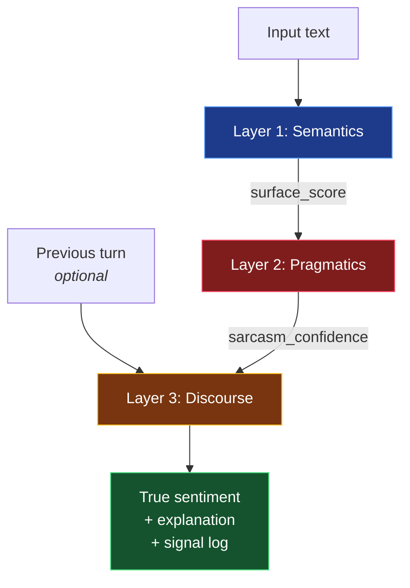

# Sarcasm & Sentiment Analyzer

> **Detects what you really mean — not just what you said.**

A three-layer NLP system that figures out when *"Oh great, another exam 😒"* is a complaint, not enthusiasm. Built without `nltk`, `spaCy`, `transformers`, or any other ML library — every decision is **fully traceable**. When the analyzer flags sarcasm, you get the receipt: which words, which emoji, which prior-context trigger fired.


<p align="center">
  <a href="https://sambhojwani.github.io/sarcasm-detection-and-sentiment-analysis/">
    
  </a>
</p>

---

## See it in action

| Input | Surface (lexicon) | True (after analysis) | What flipped it |
| :-- | :--: | :--: | :-- |
| `I love this product!` | 🟢 Positive `+0.80` | 🟢 Positive `+0.80` | — *(no sarcasm signals)* |
| `The movie was actually really good.` | 🟢 Positive `+0.75` | 🟢 Positive `+0.75` | — *(genuine, intensifier-boosted)* |
| `Great, another exam 😒` | 🟢 Positive `+0.80` | 🔴 **Negative `−0.64`** | 😒 + `"exam"` + `"another"` |
| `Oh wonderful, the server crashed again!!` | 🟢 Positive `+0.85` | 🔴 **Negative `−0.68`** | `"oh [positive]"` + `"crash"` + `"!!"` |
| `So happy my flight got cancelled. AMAZING.` | 🟢 Positive `+1.00` | 🔴 **Negative `−0.80`** | Forced positivity + negative event |
| `Oh great, more homework!` *(prior: "I hate this semester")* | 🟢 Positive `+0.80` | 🔴 **Negative `−0.89`** | Pragmatics **+** discourse stacking |

Each row is reproducible — run `python3 analyzer.py` to see the full breakdown.

---

## Try it locally

### Option 1 — Browser (recommended)

Fastest route: **[open the live version](https://sambhojwani.github.io/sarcasm-detection-and-sentiment-analysis/)**. No install, nothing sent to a server, the entire analyzer runs in your tab.

Or run the same file locally:

```bash
open index.html        # macOS
xdg-open index.html    # Linux
start index.html       # Windows
```

A self-contained, dependency-free web app: dark UI, sarcasm meter, layer-by-layer breakdown cards, signal log, and a session history. The entire analyzer is ported into client-side JavaScript — **no server, no build step, no install.**

### Option 2 — Python CLI

```bash
python3 analyzer.py
```

Runs nine annotated examples and prints surface vs. true sentiment with layer-by-layer detail.

### Option 3 — As a library

```python
from analyzer import analyze

result = analyze(
    "Great, another Monday 🙄",
    previous_context="I'm so tired of this week"
)

result.surface_sentiment      # 'Positive'
result.sarcasm_detected       # True
result.sarcasm_confidence     # 0.85
result.true_sentiment         # 'Negative'
result.sarcasm_signals        # ['Sarcasm-marker emoji(s)...', ...]
result.explanation            # Human-readable reasoning
```

---

## How it works



### Layer 1 — Semantics
Weighted polarity lexicon (~70 words) modulated by **16 intensifiers** (`very`, `extremely`, `literally`) and a **3-token negation window** (`not really good` → flipped and dampened by 0.7). Outputs a clamped score in `[-1.0, +1.0]`.

### Layer 2 — Pragmatics *(the sarcasm engine)*
Seven independent signals are scored and summed. Cross the **0.35 confidence threshold** and the surface sentiment gets flipped:

| # | Signal | Weight | Triggers on |
| :-: | :-- | :--: | :-- |
| 1 | Positive word + negative-event noun | `+0.35` | `"Love Monday meetings"` |
| 2 | Sarcasm-marker emoji | `+0.30` | `😒 🙄 🫠 😩 💀 …` |
| 3 | `"oh [positive word]"` construction | `+0.30` | `"oh great"`, `"oh wonderful"` |
| 4 | Complaint / irony opener | `+0.20` | `"another"`, `"yet another"`, `"as if"` |
| 5 | Forced positivity pattern | `+0.20` | `"i'm fine"`, `"totally can't wait"` |
| 6 | Dismissive affirmative | `+0.20` | `"yeah right"`, `"sure"`, `"totally"` |
| 7 | Heavy CAPS or `!!`/`??` | `+0.10–0.15` | `"AMAZING."`, `"why??"` |

<details>
<summary><b>How the flip works</b></summary>

When sarcasm is detected, the true score is computed as:

```
true_score = -(surface_score × 0.8) + discourse_modifier
```

The `× 0.8` dampening reflects that sarcasm rarely inverts intensity perfectly — a sarcastic `"AMAZING"` is mocking, not as strongly negative as a direct `"terrible"`.
</details>

### Layer 3 — Discourse
The optional previous conversational turn can override pragmatics. `"I'm doing fine"` is **neutral** on its own, but after `"I lost my job"` it becomes **ironic** — the discourse modifier (`−0.25`) shifts the final score even when no in-sentence sarcasm signals fire.

---

## Design philosophy

Most sentiment libraries either (a) hand it to a frozen transformer and lose interpretability, or (b) ignore sarcasm entirely. This project takes the opposite bet:

> **Enumerate the pragmatic signals a human actually uses, score them, and show your work.**

That makes it useful for:

- 🎓 **Teaching** — concrete demonstrations of semantics vs. pragmatics vs. discourse
- 🔍 **Auditing** — every label comes with a signal log you can inspect
- 🌱 **Bootstrapping** — generate weakly-labeled training data for a downstream ML model

What it gives up: recall on subtle, context-free sarcasm that lacks lexical tells. A fine-tuned transformer will beat it on out-of-domain text. **The interpretability tradeoff is intentional.**

---

## Architecture at a glance

| | |
| :-- | :-- |
| **Backend logic** | Python 3.10+, standard library only |
| **Frontend** | Single HTML file — vanilla JS, no framework, no build |
| **Dependencies** | **0** |
| **External APIs** | None (runs fully offline) |
| **Files** | `analyzer.py` (~350 LOC) · `index.html` (~700 LOC self-contained) |

---

## Limitations (honest)

- **Lexicon is English-only** and small (~70 polarity words) — out-of-vocab words contribute nothing
- **No coreference resolution** — `"It was great. (It = the disaster)"` will be misread
- **Single-turn discourse only** — looks at one prior message, not full conversation history
- **Rule-based recall ceiling** — context-free sarcasm without any lexical/orthographic tell is invisible to it

---

## Roadmap

- [ ] Multi-turn discourse window (full conversation history)
- [ ] Benchmark against annotated sarcasm corpora (SARC, iSarcasm)
- [ ] Adjustable signal weights from the UI
- [ ] Export analysis sessions as JSON
- [ ] Optional hybrid mode: rules as features into a small classifier

---

## License

[MIT](LICENSE) — use it, fork it, learn from it.
